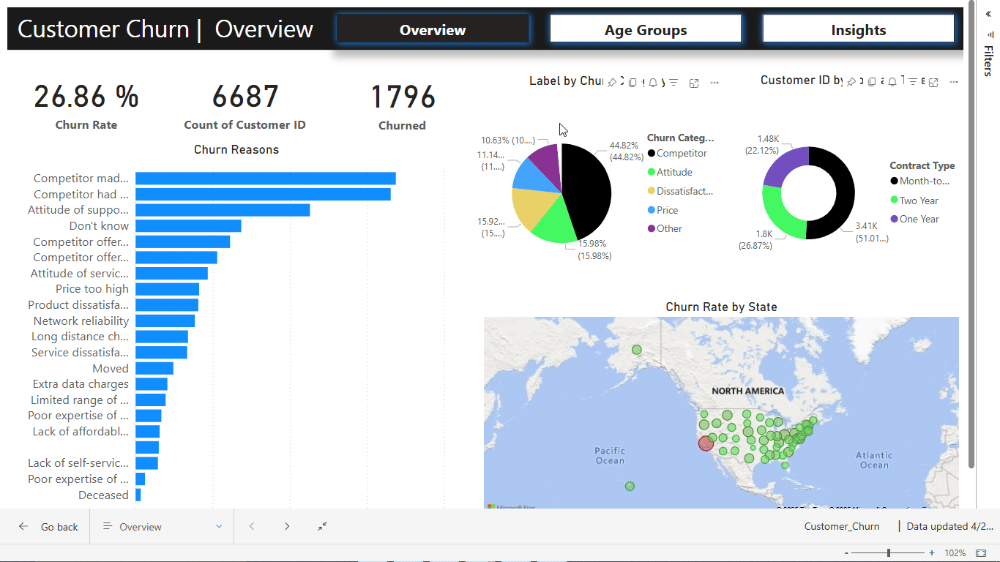

# 📊 Customer-Churn-in-PowerBI
For subscription-based businesses, reducing customer churn is a top priority.
Investigating a telecom company dataset called Databel and analyze their churn rates. 
Analyzing churn doesn’t just mean knowing what the churn rate is: it’s also about identifying the key drivers behind customer churn, 
and provide actionable insights to help reduce it. 
The analysis is delivered through an interactive Power BI report designed for business leaders and stakeholders.

## Why This Matters
Customer churn is a critical metric for subscription businesses, directly impacting revenue and long-term profitability. 
By understanding **who is leaving, why they are leaving, and when they are most likely to leave**, businesses can design targeted retention strategies to improve customer satisfaction and reduce churn.

## Here's a Glimpse of the Dashboard

## Approach & Process

### Data Preparation
- Imported and transformed telecom customer data into **Power BI**.

### Analysis & Calculations
- Developed **DAX measures** and **calculated columns** to track churn metrics, segment customers, and analyze trends across key dimensions like Contract category, Demographics, and Age bins.
- Conducted exploratory data analysis to spot initial patterns and trends.

### Report Design
- Created **multi-page, dashboard-style reports** that told a **cohesive data story** — making complex data easy to understand for non-technical stakeholders.
- Applied advanced **Power BI visualizations** to highlight trends, risk factors, and actionable insights.

### Delivery & Impact
- Delivered a **fully interactive report**, designed to serve both as a **diagnostic tool** and a **conversation starter** for leadership teams.
- Ensured the report was visually appealing and intuitive, encouraging deeper exploration and data-driven discussions around customer retention strategies.

---

## Key Takeaways
This project was a rewarding blend of **data storytelling and technical analysis** — ensuring that the insights weren’t just accurate, 
but also meaningful and accessible to decision-makers. The final report didn’t just provide numbers — it helped **connect the dots** between customer behavior and business outcomes, 
equipping the company with the insights needed to take action.

